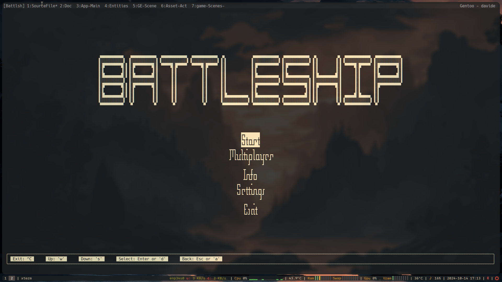

# CLI GAME ENGINE

> **_NOTE:_** Project for personal educational purposes.

- CLI application 
- Ncurses library
- ECS: Entity, Component, Systems
- Makefile [^1]
- Complete documenatation (with uml diagrams for a fast overview)
- The Game engine is not a library [^2]
- Simple battleship game made with the engine

Other spec:
- main loop single threaded

[^1]: In future CMake.
[^2]: For simplicity's sake, but it's _easly_ implementable.

## Images

## Requirements
- Linux

In most distro `Ncurses` is installed by default, otherwise you need to install the library. Check also if `Ncursesw` for wide character support is present.

> **_NOTE:_** Note on log file:
> - it is raccomanded to open the log file with therminal program like `less`, `cat`, etc...
> - in `.bashrc`, or `.zshrc`, or whatever you have, add `export CLICOLOR=TRUE` if colors are not displayed.

## Compiling

### Compiling Flags 
The main compiling flags are:
- Ncurses: `-lncurses`
    - For wide character support: `-lncursesw`
- In some cases the ncurses library is split in this other library: `-ltinfo` (use this flag if the compiler give an error on undefined reference to `stdscr`)
    - For wide character support: `-ltinfow`
- form?
- Debugging: `-g`, `-Wall`

## ECS

### Conventions:
- before component class name `C..`, es: `CSprite`, `CBox`, ...
- before component instatiation of class `c...`, es: `cSprite`, ...
- this two roule are the same with systems with `s`

### General:
- Components: store only pure data, no logic
- Systems are function or classes
- Systems operate on entities that have some precise component

### Systems order in game loop:
1. Input
2. Movement
3. Physics
4. AI
5. Renderer

# Writing Convenctions:
- sructs name: small letters with maiusc letter to separate 
- enum name, enum value: maiusc name with `_` as separator
- variable and function name use maiusc character as separator: es: `gameEngine`, `modGravityExp`, `veryLongVariable` ...
- private data member start with `m_` and `s_` for static

# TODO
No particular order:
- ~~Multi scene managment~~
- ~~Action managment~~
- ~~Game loop~~
- ~~Add custm logger~~
- Add custom assertions
- Add custom memory allocator
- ~~Assets managment~~
- ~~Riorganizzare l'ordine nelle cartelle del progetto~~
- Ricontrollare le incluzioni negli header file
- ~~Cambiare il vettore di shared pointer di entity in altro (vettore di puntatori normali?)~~
- ~~Implementare la rimozione delle entità nell'entity manager~~
- ~~Add wide character compatibility for ncurses~~
- Implementare la prima scena di un menu
- implementare la scena di gioco
- Implementare la logica di gioco
- Implementare la scena pausa
- spostare tutte le definizioni degli enum nei corrispettivi header file ???
- ~~rinominare la classe `scenaBase` in `scene`~~
- Add licence to the repository

# Future Optimizations
- custom memory allocator, array?, vector, math, phisics library
- all the systems
- implements grapics api 
- separare il core engine dai sistemi e dal source code del gioco
- 

# TO ADD in future 
- a way to verify that for each constructor called is being also called the destructor, usefull??
- Collisiion detection with a grid of detection (for close distance collision) like in the particle simulations programs
- for each entity, texture, world map, landscape, animations, lightining, sounds, particle system, AI systems, ..., objects create a fictitious preview (fast to render) to fast test this object while they are being constructed (coded)
- Separete the game engime static code from the compilation code of the game
- math and physiscs library
- documentations (online, pdf, linux manpage, windows??, AI chatbot?)
- Vulkan API, wayland? X11? 
- tools nvim (vscode?) plugin

